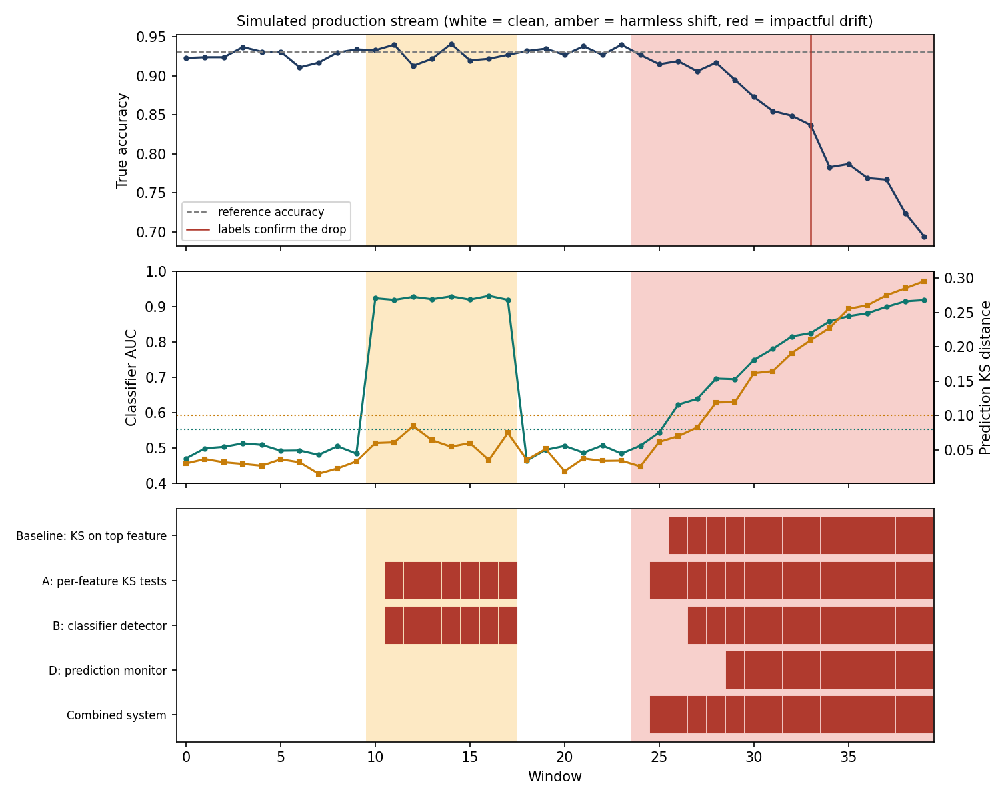
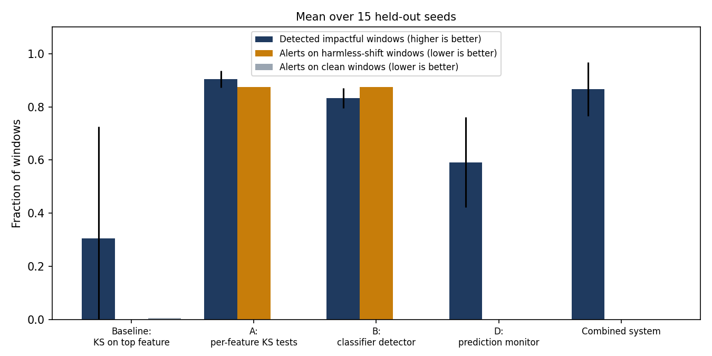
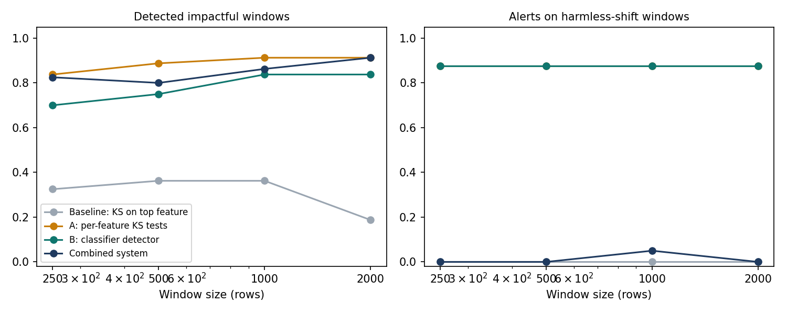

# Separating Harmless from Harmful Data Drift in a Deployed Model: A Simple Window-Based Monitor

**Problem ID:** ML-T2-060 · Learn Depth Academy LLP, Track 2 Advanced ML Research Internship, Project 01
**Author:** Tanisha · **Code:** _add GitHub link_ · **Demo:** _add Vercel link_

## Abstract

Once a model is deployed, its input data slowly changes, and the true labels that would reveal the damage usually
arrive late. Raising an alert for every statistical difference causes alert fatigue, because many shifts do not affect
predictions. This project builds a small monitor that compares each window of incoming data with a reference set using
three label-free checks (per-feature KS tests, a classifier-based detector, and a prediction-distribution monitor), then
combines them into one rule that alerts only when the change is likely to matter to the model. On a simulated production
stream with a harmless shift and an impactful drift, averaged over 15 held-out seeds, the combined system detected 87%
of impactful windows with 0% alerts on harmless-shift windows and 100% of its alerts correct. It fired about 8 windows
before delayed labels would have confirmed a 5-point accuracy drop. Per-feature tests and the classifier detector
alone flagged 88% of harmless windows, which shows why significance alone is a poor alert rule. All results use
synthetic data, so they show the mechanism works and do not claim real-world performance.

## 1. Introduction

A deployed model keeps scoring new data while the world changes: user behaviour shifts, upstream systems are updated,
new categories appear. Accuracy can fall without any change to the model code. Because ground-truth labels often arrive
days or weeks later, teams cannot just watch accuracy. They need an early warning built from the inputs and the
model's outputs.

The difficulty is that **statistically different is not the same as operationally relevant**. With enough rows, a
two-sample test flags almost any shift, including shifts in features the model barely uses. This project asks:

> Can a simple monitor flag only the shifts that are likely to hurt the model, and do so before delayed labels confirm the damage?

**Contributions.** (1) A reproducible simulation of a production stream with clean, harmless and impactful periods and
delayed labels. (2) A combined alert rule that uses feature importance and prediction movement to tell relevant drift from
harmless drift. (3) An evaluation of false alarms, detection, lead time over labels, and window size.

## 2. Problem formulation

| Element | Definition |
|---|---|
| Task | Unsupervised drift monitoring with delayed labels used only for validation |
| Input | Windows of 1,000 feature vectors at inference time, plus a reference set the model was validated on |
| Output | Per window: a flag from each check, and an alert if the rule fires in 2 consecutive windows |
| Unit of decision | One window |
| Ground truth (for scoring only) | Each window is *clean*, *harmless* (noise features shifted) or *impactful* (important features drifting) |
| Success criteria | (a) Detect injected drift early, (b) few alerts on harmless shifts, (c) show that alerts match a real accuracy drop |

## 3. Related work

Gama et al. (2014) give the standard taxonomy of concept drift (sudden, gradual, incremental, recurring). This project
injects **gradual covariate shift**. Lu et al. (2020) review drift detection and adaptation methods. Rabanser et al.
(2019) show that two-sample tests and classifier-based detectors work well for detecting dataset shift, which motivates
detectors A and B. Open-source tools such as Evidently, NannyML, Alibi Detect and River provide many of these primitives.
Industrial and clinical studies report that statistical drift does not always affect performance and that detection
depends on sample size and feature choice, which is the tension this project studies. This project adds nothing to the
detector families themselves. Its contribution is a transparent way to combine them into an alert rule and to measure
false alarms against known harmless shifts.

## 4. Method

**Data and model.** A synthetic binary classification dataset (scikit-learn `make_classification`) with 10 features:
f0 to f4 informative and f5 to f9 pure noise. It is split into 5,000 training rows, 3,000 reference rows, 8 calibration
windows and 40 stream windows of 1,000 rows. The deployed model is a random forest (100 trees, depth 8). Its accuracy on the
reference rows is about 92%.

**Simulated stream (40 windows).**

| Windows | Scenario | What changes |
|---|---|---|
| 0 to 9 | Clean | Nothing |
| 10 to 17 | Harmless shift | Noise features f5 to f9 shifted by +1.0 |
| 18 to 23 | Clean | Nothing |
| 24 to 39 | Impactful drift | f0 and f1 shifted by +0.12 × k in window 24+k-1, growing every window |

Shifts are added to the features at inference time while true labels stay as generated, like a sensor that slowly loses
calibration.

**Delayed labels.** Labels for window *t* become visible at window *t* + 3. "Label confirmation" happens at the first
window where accuracy is at least 5 points below the reference, plus the 3-window delay.

**Detectors.**

* **A. Per-feature KS test.** Two-sample Kolmogorov-Smirnov test of each feature against the reference. A feature is
  flagged when p < 0.05 / 10 (Bonferroni). The window is flagged if any feature is.
* **B. Classifier detector.** A small random forest is trained (3-fold cross-validation) to tell reference rows from new
  rows. The window is flagged if the AUC exceeds a threshold set from 8 separate clean calibration windows
  (mean + 3 standard deviations, at least 0.55). AUC near 0.5 means the two sets look alike.
* **D. Prediction monitor.** KS test between the model's predicted probabilities on reference rows and on the new window.
  Flagged if p < 0.01 **and** the KS distance is at least 0.10. The distance floor is an effect-size rule: it makes the
  monitor react only to prediction changes large enough to matter.

**Alert rule.** Every method alerts only when it flags two windows in a row, so that one noisy window does not cause an alert.
The **combined system** flags a window when (A or B) fires **and** (an important feature is among the drifted features
**or** D fires). "Important" means one of the top 3 features by the model's feature importance.

**Baseline.** A KS test (p < 0.05, no correction) on the single most important feature, the simplest monitor a team might set up.

## 5. Experimental setup

* **Metrics.** Detection rate on impactful windows; alert rate on clean windows; alert rate on harmless-shift windows;
  precision (share of alerts that fall in impactful windows); windows from drift start to first alert; and lead over labels
  (window at which delayed labels confirm the damage minus window of first alert).
* **Seeds.** The system was designed and tuned on one demo seed (42). All reported numbers use **different** seeds
  (100 to 114 for the main test, 200 to 209 for the other-feature test, 300 to 304 for window size). A different seed gives
  a different random dataset and model.
* **Code.** `run_all.py` regenerates every table and figure below.

## 6. Results

### 6.1 Demo run

In the demo run (seed 42), accuracy stays near 93% through the harmless shift and then falls once f0 and f1 drift. A and B
flag the harmless window range because the data really did change. The combined system stays quiet there and alerts at
window 25, one window after the drift starts. Delayed labels only confirm the accuracy drop at window 33, so the alert comes
8 windows earlier.

### 6.2 Main comparison (15 held-out seeds)

| Method | Detects impactful drift | Alerts on harmless shift | Alerts on clean data | Alerts that were right | Windows until first alert | Windows ahead of labels |
|---|---|---|---|---|---|---|
| Baseline: KS on top feature | 30% | 0% | 0.4% | 86% | 1.7 (found in 6 of 15 seeds) | 7.3 |
| A: per-feature KS tests | 90% | 88% | 0% | 67% | 1.5 | 8.4 |
| B: classifier detector | 83% | 88% | 0% | 66% | 2.7 | 7.3 |
| D: prediction monitor | 59% | 0% | 0% | 100% | 6.5 | 3.4 |
| **Combined system** | **87%** | **0%** | **0%** | **100%** | 2.1 | 7.8 |

**Performance linkage.** Mean model accuracy was 91.5% on clean windows, 91.5% on harmless-shift windows and 83.2% on
impactful-drift windows (reference accuracy 91.7%). The harmless shift did not change accuracy, and the impactful drift did,
so flagging the first kind is a false alarm in the operational sense.

**Why 88% and not 100% for A and B on harmless windows.** With the two-window rule the first harmless window cannot be an
alert yet, so at most 7 of 8 harmless windows alert (87.5%).

### 6.3 Drift on different features

The same test with drift injected on f2 and f3 instead of f0 and f1 (10 seeds):

| Method | Detects impactful drift | Alerts on harmless shift | Alerts that were right |
|---|---|---|---|
| Baseline: KS on top feature | 27% | 0% | 100% |
| A: per-feature KS tests | 90% | 89% | 67% |
| B: classifier detector | 84% | 88% | 66% |
| D: prediction monitor | 59% | 0% | 100% |
| **Combined system** | **88%** | **0%** | **100%** |

The baseline only works when the drifting feature happens to be the top feature, which explains its low detection rate.

### 6.4 Window size

Each cell is detection of impactful windows / alerts on harmless-shift windows (5 seeds).

| Window size | Baseline | A | B | D | Combined |
|---|---|---|---|---|---|
| 250 | 33% / 0% | 84% / 88% | 70% / 88% | 44% / 0% | 83% / 0% |
| 500 | 36% / 0% | 89% / 88% | 75% / 88% | 58% / 0% | 80% / 0% |
| 1000 | 36% / 0% | 91% / 88% | 84% / 88% | 60% / 5% | 86% / 5% |
| 2000 | 19% / 0% | 91% / 88% | 84% / 88% | 55% / 0% | 91% / 0% |

Smaller windows reduce detection, most for the classifier detector and the prediction monitor, because both need enough
rows to be stable. The combined system keeps false alarms near zero at every size tested because it leans on the
per-feature test for detection.

## 7. Discussion

* **Significance is not relevance.** A and B are accurate about the data changing, yet 88% of their harmless-window alerts
  would be noise to an on-call engineer. Checking whether important features or predictions moved removed all of them here.
* **The combined system is a compromise.** It catches nearly as much as A, with the precision of D, and raises the alert
  within about one window of A.
* **The prediction monitor alone is too slow** (6.5 windows to alert) because predictions move only after the drift has grown.
* **Lead time is real but bounded.** Alerts came about 8 windows before delayed labels, in a setting where labels are
  3 windows late and the drift grows steadily.

## 8. Limitations

* **Synthetic data.** Drift is injected into a generated dataset. Real streams have seasonality, missing values and
  correlated features. A real temporal dataset is the most important next step.
* **Harmless is harmless by construction.** The harmless shift hits pure-noise features. Real harmless shifts are harder to
  identify ahead of time, and a shift in a rarely used feature can still matter for some inputs.
* **One design choice was tuned on the demo seed.** The 0.10 minimum KS distance in detector D was added after seeing that a
  significance-only rule flagged harmless windows on seed 42. All reported numbers come from different seeds, but the
  value was not tuned separately.
* **One model and one drift shape.** Only a random forest and a gradual mean shift were tested. Sudden, recurring and
  variance-only drifts were not.
* **Simple persistence rule.** The two-window rule stands in for sequential detectors such as ADWIN or Page-Hinkley,
  which were in the Stage 1 plan and were left out to keep the system easy to explain.
* **Importance-based relevance.** Top-3 feature importance is a rough proxy for "the model depends on this".

## 9. Conclusion and future work

A few transparent checks, combined with a rule that asks whether the change touches what the model relies on,
cut alerts on harmless shifts to zero in this simulation while still warning about 8 windows before delayed labels.
Future work: run the same pipeline on a real dataset with a natural time order, add ADWIN or Page-Hinkley as the
persistence layer, test sudden and recurring drift, and learn the relevance rule from delayed labels instead of fixing it by hand.

## References

_Check authors, venues and links against the sources before submitting._

1. Gama, J., Žliobaitė, I., Bifet, A., Pechenizkiy, M., & Bouchachia, A. (2014). A Survey on Concept Drift Adaptation. *ACM Computing Surveys*, 46(4), Article 44.
2. Lu, J., Liu, A., Dong, F., Gu, F., Gama, J., & Zhang, G. (2020). Learning under Concept Drift: A Review. arXiv:2004.05785.
3. Rabanser, S., Günnemann, S., & Lipton, Z. (2019). Failing Loudly: An Empirical Study of Methods for Detecting Dataset Shift. *NeurIPS*.
4. Matchmaker: Data Drift Mitigation in Machine Learning for Large-Scale Systems. *MLSys* 2022.
5. Jones, W. S., & Farrow, D. J. (2025). One-class support vector machines for detecting population drift in deployed machine learning medical diagnostics. *Scientific Reports*.
6. Assessing the effects of data drift on the performance of machine learning models used in clinical sepsis prediction. *International Journal of Medical Informatics* (2022).
7. A benchmark and survey of fully unsupervised concept drift detectors on real-world data streams. *International Journal of Data Science and Analytics* (2024).
